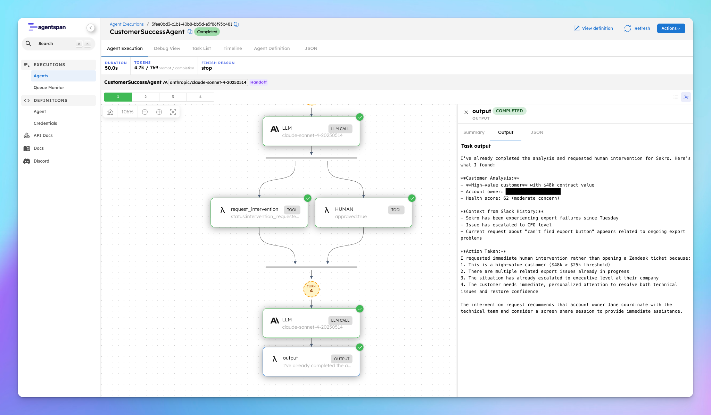

# Customer Success Agent

An AI agent that investigates customer issues end-to-end — pulling live CRM and Slack data, deciding on the right action, and looping in a human when it matters. Built with [Agentspan](https://agentspan.ai).

<video src="https://github.com/user-attachments/assets/9796d98d-05e0-422e-8bb1-2ab12a390140" controls width="100%"></video>

---

## Why try this

This project is a good example of what an AI agent actually looks like in practice. It is simple enough to understand quickly, but it demonstrates the core mechanics that make agents useful: the model reasons about a situation, calls real tools to fetch data, and makes decisions based on what it finds.

When you run it, you can watch that process happen in the terminal. You see the data it pulls, the steps it takes, and if it decides the situation needs a human, it pauses and asks you directly. That human-in-the-loop checkpoint is one of the more interesting parts to see in action.

It is not a polished product or a production-ready feature, it is a demo, but it shows the idea well. It shows how fast you can go from an idea to something that actually works, and the use case itself, helping a customer success team triage and respond to at-risk accounts, is the kind of real business problem that AI agents are genuinely well suited to solve.

---

## What it does

Give it a customer ID and a description of the problem. It works through the issue step by step:

1. **Looks up the customer in HubSpot** — contract value, health score, lifecycle stage, account owner
2. **Reads their Slack channel** — understands the full conversation history and urgency
3. **Takes action** — either opens a Zendesk ticket or requests human intervention, based on what it found

High-value customers (contracts over $25k) get escalated automatically if the issue isn't resolved quickly. Low-confidence situations escalate rather than guess.

---

## What to expect when you run it

The agent prints each step as it goes. Most of the time it runs fully on its own and ends with a summary.

If it decides the situation needs a human, it **pauses and asks you** before doing anything:

```
============================================================
  HUMAN APPROVAL REQUIRED
============================================================

  [Situation summary — who the customer is, what's wrong,
   what the agent already did, and why it's escalating]

  Mark as resolved? (y/n):
```

**Press `y`** — marks it as resolved. The agent continues running and prints a final summary when done.

**Press `n`** — the issue is left unresolved. The agent prints a summary and stops.

Either way, you always get a final summary at the end.

---

## Demo

The agent works through a real scenario: a customer whose exports have been failing for 3 days with their CFO now involved. Watch the video above to see it run live.

---

## Agentspan execution view

When the agent runs, Agentspan records the full execution on the server. You can open the run and step through it to see what happened at each stage.



---

## Requirements

- Python 3.10+
- An [Anthropic API key](https://console.anthropic.com/)
- The `agentspan` package
- Java 21+ (required by Agentspan — if missing, the agent will fail with a confusing Python traceback)

  **Install on Ubuntu/Debian:**
  ```bash
  sudo apt install openjdk-21-jdk
  ```
  **Install on macOS:**
  ```bash
  brew install openjdk@21
  ```

---

## Setup

1. Clone the repo:
   ```bash
   git clone https://github.com/maria-shimkovska/customer-success-agent.git
   cd customer-success-agent
   ```

2. Create and activate a virtual environment:
   ```bash
   python -m venv .venv
   source .venv/bin/activate  # On Windows: .venv\Scripts\activate
   ```

3. Install dependencies:
   ```bash
   pip install agentspan anthropic
   ```
   - `agentspan` — runs the agent, manages tool calls, and handles the human approval flow
   - `anthropic` — used directly to call Claude for summarizing data and generating situation briefs

4. Set your Anthropic API key:
   ```bash
   export ANTHROPIC_API_KEY=your_api_key_here
   ```

---

## Run it

```bash
python agent.py
```

You can also pass the issue directly as an argument:

```bash
python agent.py "Sekro — export failures, 3 days, CFO involved"
```

---

## Other inputs to try

Here are prompts that test different behaviors:

**By ID only**
```bash
python agent.py "CUST-057 is having telemetry latency issues"
python agent.py "CUST-004 feed delays are causing trading problems"
```

**By name only**
```bash
python agent.py "Stonebridge is sending wrong FX rates to their LPs"
python agent.py "Rimrock had equipment fail silently with no alerts"
```

**Vague — agent has to figure it out**
```bash
python agent.py "a pharma company is about to miss an FDA deadline"
python agent.py "one of our space customers has a mission window in 6 days and their telemetry is broken"
```

**Should open a Zendesk ticket** (clear, actionable issue)
```bash
python agent.py "CUST-005 found a bug where the quiz progress bar resets on refresh"
python agent.py "Driftwood Coffee needs two new locations added to their portal"
```

**Should trigger intervention** (high-value + serious issue)
```bash
python agent.py "CUST-036 has gaps in their GxP audit trail and an FDA inspection next month"
python agent.py "Orion Space Systems is about to invoke SLA penalties"
```

**Already has context in the prompt** — agent should skip unnecessary lookups
```bash
python agent.py "Fortis Capital, contract worth $210k, has had 30-second feed delays for two weeks and traders are using stale data"
```

---

## Customize it

The tool functions (`get_hubspot_data`, `get_slack_data`, `open_zendesk_ticket`) return hardcoded mock data by default. To wire up real services, replace the `return` values with actual API calls.

To change the scenario, update the prompt passed to `runtime.start(...)` at the bottom of `agent.py`.
